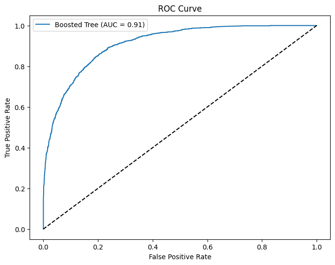

# Census Income Prediction Project 💰

### Overview
This project implements an end-to-end machine learning pipeline using pure Python and Scikit-Learn. It builds a binary classification model to predict whether an individual's income exceeds $50K/year based on census data, focusing on handling real-world data challenges like missing values and class imbalance.

### Key Features
* **Data Handling:** Imputed missing values and handled categorical encoding.
* **Imbalance Correction:** Used SMOTE (Synthetic Minority Over-sampling Technique) to fix class imbalance.
* **Model:** Trained a Gradient Boosting Classifier.
* **Deployment:** Serialized the final model using `joblib` for inference.

### Results
* **High Confidence:** The deployed model correctly identified test cases with >90% confidence.
* **AUC Score:** 0.91
### Test Results
* **Loaded Model Prediction:** <=50K
* **Confidence:** 7.31%
* **Interpretation of Test Results:** The model is 92.69% sure that the individual earns less than $50,000. This demonstrates the model's capability to distinguish low-income profiles with high certainty.

### Project Files
* `End-to-End ML Pipeline.ipynb`: The complete Google Colab notebook.
* `census_income_model.joblib`: The saved model file ready for deployment.

